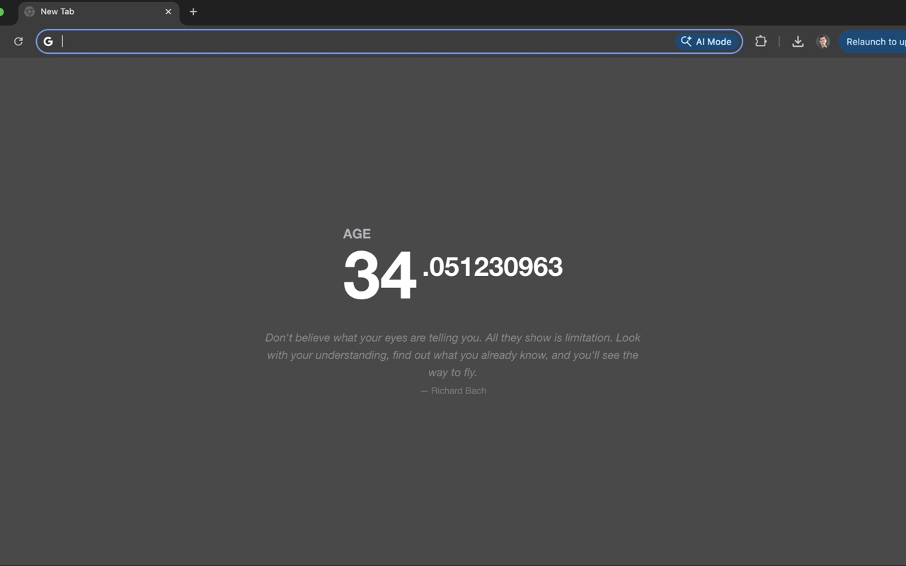
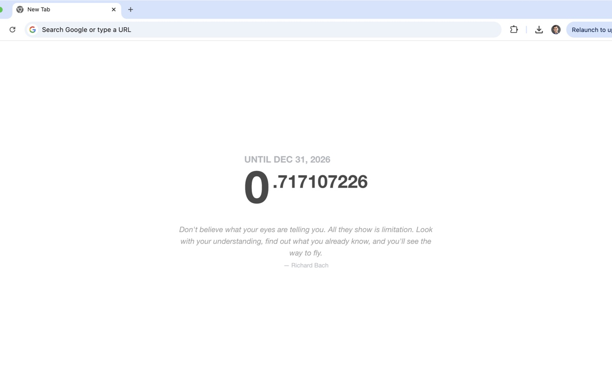
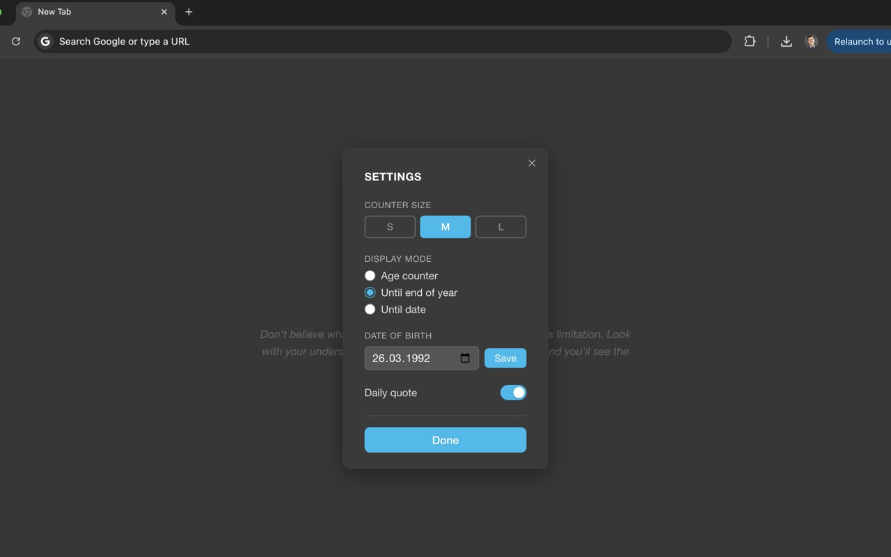

# Motivation Counter Extension

A modernized version of Alex MacCaw's iconic "Motivation" Chrome extension, updated for current browser standards and expanded with new counter modes.

[](https://chromewebstore.google.com/detail/motivation-counter/jgebglhbeenjoehfkglemcfaimddnggl)

**[Website](https://1gory.github.io/motivation-age-counter-extension/)** &nbsp;·&nbsp; **[Privacy Policy](https://1gory.github.io/motivation-age-counter-extension/privacy-policy.html)**





## Credits & Attribution

**This extension is based on the original work by [Alex MacCaw](https://github.com/maccman).**

The original "Motivation" extension was created in 2013 and became beloved by thousands of users for its simple yet profound concept. This version exists to preserve and extend that experience as Chrome's extension platform has evolved.

All credit for the original concept, design, and implementation belongs to Alex MacCaw.

## What It Does

- Replaces your new tab page with a real-time counter
- Three display modes (switchable in settings):
  - **Age counter** — shows your age in years with millisecond precision
  - **Until end of year** — countdown to December 31
  - **Until date** — countdown to any date you choose
- Daily quote — a new quote each day from a curated collection
- Clean, minimalist design that adapts to light and dark mode
- Completely private — all data stays in your browser

## Settings

Click the ⚙ icon in the bottom-right corner to:
- Switch display mode
- Set a target date for countdown
- Change your date of birth
- Toggle the daily quote
- Adjust counter size (S / M / L)

## Privacy & Technical Details

- No data collection, analytics, or external connections
- All data stored locally via `localStorage`
- Works completely offline
- Built with Manifest V3 for modern Chrome browsers
- Vanilla JavaScript, no external libraries

## Installation

### From Chrome Web Store
1. Visit the [Chrome Web Store page](https://chromewebstore.google.com/detail/motivation-counter/jgebglhbeenjoehfkglemcfaimddnggl)
2. Click "Add to Chrome"
3. Enter your birth date when prompted

### Manual installation (without Chrome Web Store)

**English**

1. Go to the [Releases page](https://github.com/1gory/motivation-age-counter-extension/releases) and download the latest `motivation-counter-vX.X.X.zip`  
   *(or on the main page click **Code → Download ZIP** and unpack it)*
2. Unpack the ZIP — you will get a folder with the extension files
3. Open Chrome and type `chrome://extensions/` in the address bar, press Enter
4. Turn on **Developer mode** — the toggle is in the top-right corner of the page
5. Click **Load unpacked** and select the unpacked folder
6. The extension icon will appear in the toolbar. Pin it by clicking the puzzle icon → pin next to the extension name
7. Open a new tab — the counter will appear right away

> Works in any Chromium-based browser: Chrome, Brave, Edge, Opera, Vivaldi.

---

**Русский**

1. Перейдите на [страницу релизов](https://github.com/1gory/motivation-age-counter-extension/releases) и скачайте последний файл `motivation-counter-vX.X.X.zip`  
   *(или на главной странице репозитория нажмите **Code → Download ZIP**)*
2. Распакуйте ZIP-архив — появится папка с файлами расширения
3. Откройте Chrome и введите в адресной строке `chrome://extensions/`, нажмите Enter
4. Включите **Режим разработчика** — переключатель в правом верхнем углу страницы
5. Нажмите **Загрузить распакованное расширение** и выберите распакованную папку
6. Иконка расширения появится на панели инструментов. Закрепите её: нажмите иконку пазла → значок булавки рядом с названием расширения
7. Откройте новую вкладку — счётчик появится сразу

> Работает в любом браузере на основе Chromium: Chrome, Brave, Edge, Opera, Vivaldi.

## Development

### Run tests
```bash
npm test
```

### Package for release
```bash
zip -r motivation-counter-v1.1.1.zip manifest.json dashboard.html css/ icons/ app/app.js app/daily-quote.js app/quotes.js
```

The zip includes only the files required by the extension. Do **not** include `node_modules/`, `app/app.test.js`, screenshots, or any markdown files.

## Legal & Disclaimer

This project is a technical modernization of Alex MacCaw's original work, created for users who wish to continue using this extension. We claim no ownership of the original concept, design, or intellectual property.

If you are Alex MacCaw or represent his interests and have any concerns about this project, please contact us immediately.

## License

This modernized implementation is provided under the MIT License for the technical updates only. All rights to the original concept and design remain with Alex MacCaw.

---

*Made with respect and gratitude for Alex MacCaw's original vision.*
